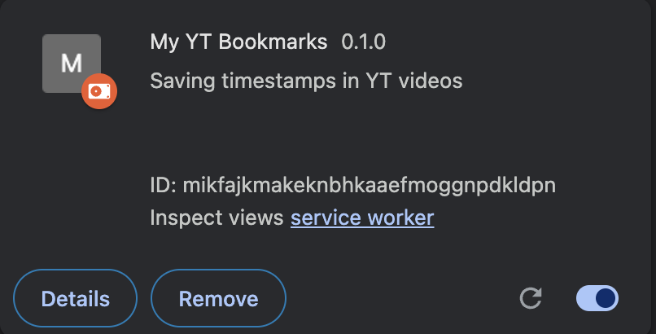
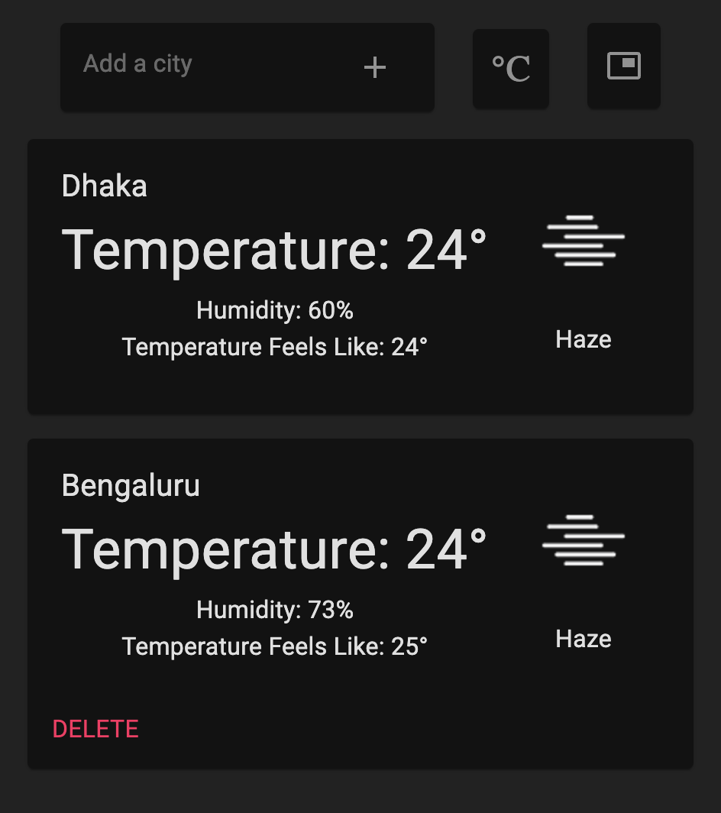
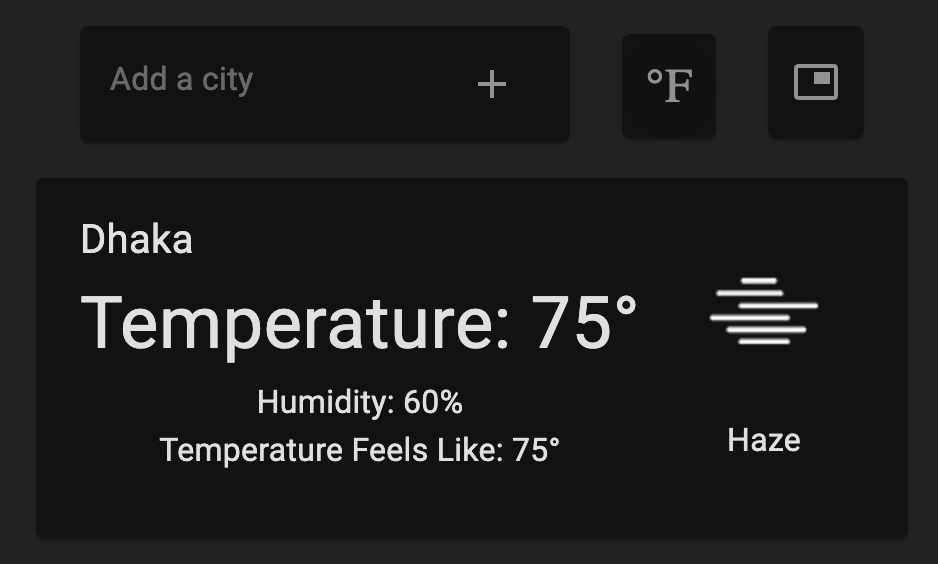

# Project Title

### Chrome Weather Extension

 

## Project Description

This is a chrome extension that displays the weather for the city added by the user. User can add multiple cities and can delete them as well. It is build using `React`, `TypeScript`, `Webpack` and `Manifest V3`.

 

 

## Getting Started

0. `git clone` - https://github.com/varungupta04/Extension
1. `cd weather_ext` - to get to the right extensions directory
2. `npm i` to install dependancies
3. `npm start` to start running the fast development mode Webpack build process that bundle files into the `dist` folder. (use `npm run build` to use the production build)
4. Go to `chrome://extensions/` and toggle on `Developer mode`.
5. Click `Load unpacked` and select the entire `dist` folder.
6. Now you can see the extension, enable it to use it.

 

## How to Use

1. **Installing the Extension:**
   - To install, first unpack the folder in the Chrome extension area.  
     

2. **Managing Cities:**
   - Once installed, you can add multiple cities to view their weather. You can see the weather details and use the delete button to remove a city from the list if needed.  
     

3. **Viewing City Weather:**
   - On regular use, you can view the weather details for your added cities, including temperature, humidity, and the "feels like" temperature.  
     
## Loading The Chrome Extension

1. Open Chrome and navigate to `chrome://extensions/`
2. Toggle on `Developer mode` in the top right corner
3. Click `Load unpacked`
4. Select the entire `dist` folder
   

 

## Production Build

1. `npm run build` to generate a minimized production build in the `dist` folder
2. ZIP the entire `dist` folder (e.g. `dist.zip`)
3. Publish the ZIP file on the Chrome Web Store Developer Dashboard!

 

Features:

	1.	You can set your home city in the extension options, so it always appears at the top of the list.
	2.	Add as many cities as you’d like to keep track of their weather.
	3.	Easily switch between Celsius and Fahrenheit to view temperatures in your preferred scale.
	4.	Remove any cities from your list whenever you want.
	5.	Quickly check the current weather of any city right from the extension popup.
	6.	You can choose whether to show the popup by toggling this option in the settings.
	7.	View key details like Temperature, Humidity, and “Feels Like” temperature for each city.
 
 

