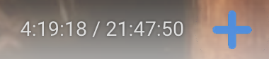

# YouTube Bookmark Extension

This Chrome extension allows you to easily **bookmark timestamps** in YouTube videos. It's perfect for keeping track of important moments in long YouTube videos, especially useful for **audiobooks** and **educational videos**.

## Purpose
As someone who often listens to long YouTube videos (like audiobooks and educational content), I created this extension to help mark specific moments in the video that I can easily return to later. I hope this extension will be useful to others who have a similar need for tracking important timestamps in videos.

## Features
- **Bookmark Timestamps**: Add timestamps to your favorite moments in a YouTube video.
- **Easy to Use**: One-click bookmarking while watching a YouTube video.
- **Customizable**: Allows you to save multiple bookmarks for different times in the video.

## Installation

1. **Clone the repo** using the following command:
   ```bash
   git clone https://github.com/varungupta04/Extension/youtube_bookmark
2.  Then follow the below steps to unpack it into chrome
3.	Open chrome://extensions in your browser.
4.	Enable Developer Mode (toggle at the top-right).
5.	Click Load unpacked and select the folder where the extension files are located.
6.	Now the extension should be funcitonal on your lcoal machine

## How to Use

1. **Adding a Timestamp:**
   - While watching a YouTube video, look for the plus button next to the video length. Click it to bookmark the current timestamp for easy reference later.
   - 

2. **Viewing Your Bookmarks:**
   - Once you’ve bookmarked timestamps, click on the extension icon at the top of your browser. This will show you a list of all the saved timestamps for that video.
   - 

3. **Using the Extension on Non-YouTube Pages:**
   - If you try to use the extension on a non-YouTube page, you’ll see a message reminding you that the extension only works on YouTube.
   - 


Browser Compatibility

This extension works on Google Chrome and any other Chromium-based browsers such as:

	•	Chromium
	•	Brave
	•	Edge
	•	Opera

 FAQs

How do I manage my bookmarks?

You can access and manage your saved timestamps directly from the extension’s popup menu. Each timestamp will have a link that you can click to return to the specific moment in the video.

Can I remove or edit a bookmark?

Yes, you can delete or edit a bookmark at any time by clicking the appropriate option in the extension’s interface.

Does this extension work on mobile?

Currently, this extension only works on desktop versions of Chromium-based browsers.
